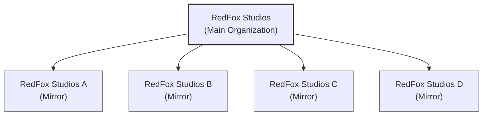

# RedFox Studios - Mirror C

This is an official mirror repository of [RedFox Studios](https://github.com/RedFox-Studios). We maintain multiple mirrors for enhanced security, redundancy, and geographical distribution of our codebase.

## About This Mirror

This repository serves as one of several official mirrors of RedFox Studios' projects. Our mirroring strategy ensures:

- Continuous availability of our codebase
- Protection against potential platform-specific issues
- Geographic redundancy for better access
- Enhanced backup and security measures

## Mirror Structure

## Official Mirrors

- Main Organization: [RedFox-Studios](https://github.com/RedFox-Studios)
- Mirror A: [RedFox-Studios-A](https://github.com/RedFox-Studios-A)
- Mirror B: [RedFox-Studios-B](https://github.com/RedFox-Studios-B)
- Mirror C: [RedFox-Studios-C](https://github.com/RedFox-Studios-C)
- Mirror D: [RedFox-Studios-D](https://github.com/RedFox-Studios-D)

## Contributing & Joining RedFox Studios

If you're interested in joining RedFox Studios:

1. Visit our github.io website: [https://redfox-studios.github.io/](https://redfox-studios.github.io/)
2. Fill out the membership application form
3. Our team will review your application and contact you

## Important Notes

- This is a read-only mirror
- For issues, pull requests, and discussions, please use the main repository
- Always verify you're working with the official RedFox Studios repositories

## Contact

For any questions or concerns regarding this mirror, please reach out through the main organization's channels.
